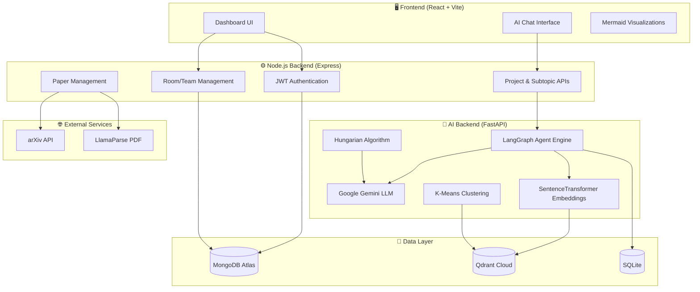
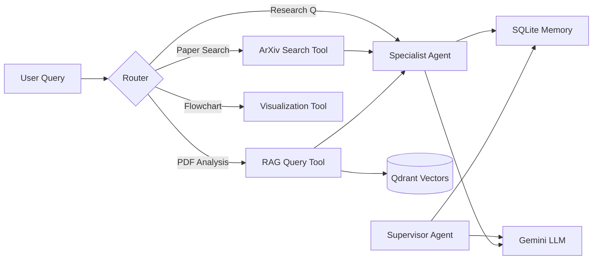
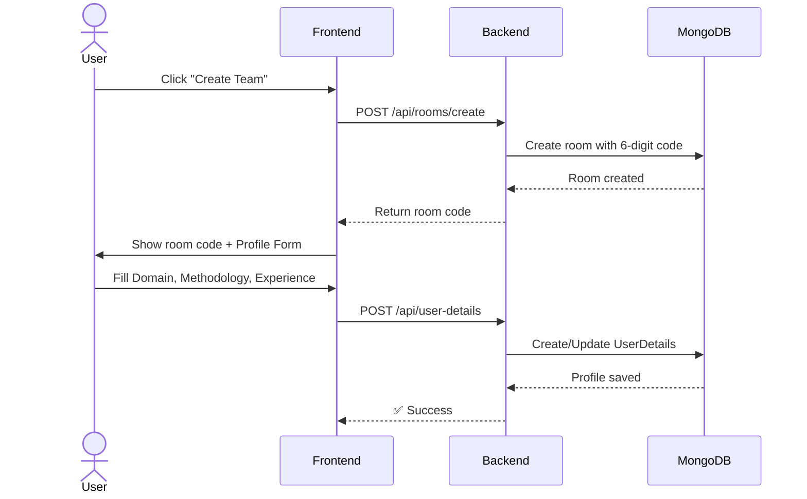
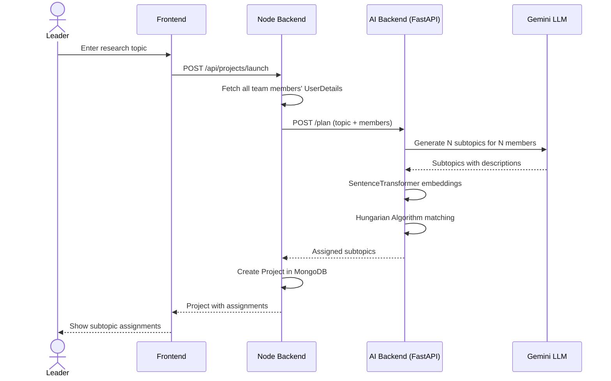
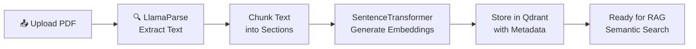
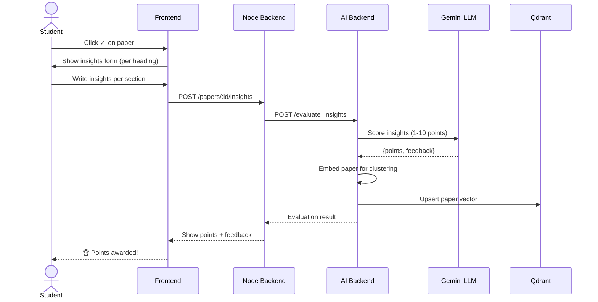
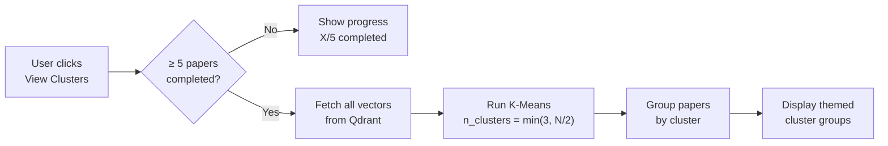
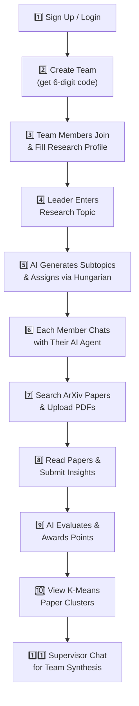

<p align="center">
  <h1 align="center">🚀 OdysseyAI</h1>
  <p align="center"><b>AI-Powered Collaborative Research Platform</b></p>
  <p align="center"><i>Full Technical Documentation</i></p>
</p>


---

## Table of Contents

| # | Section |
|---|---------|
| 1 | [Project Overview](#1-project-overview) |
| 2 | [Architecture Overview](#2-architecture-overview) |
| 3 | [Setup and Installation](#3-setup-and-installation) |
| 4 | [API Documentation](#4-api-documentation) |
| 5 | [Agent Documentation](#5-agent-documentation) |
| 6 | [Database Schema](#6-database-schema) |
| 7 | [Key Workflows](#7-key-workflows) |
| 8 | [Features Guide](#8-features-guide) |
| 9 | [Design Decisions](#9-design-decisions) |
| 10 | [Known Limitations & Future Work](#10-known-limitations--future-work) |
| 11 | [Demo Guide](#11-demo-guide) |

---

## 1. Project Overview

**OdysseyAI** is a collaborative AI-powered research platform designed to help research teams explore scientific literature, divide complex research topics, and synthesize insights efficiently. The system integrates large language models, semantic search, and collaborative memory to guide teams through the entire research lifecycle.

### The Problem

The platform addresses the challenge of **information overload** in modern research. With thousands of papers published daily, researchers struggle to:

- 🔍 Discover relevant literature across vast repositories
- 🤝 Coordinate team efforts and avoid duplication of work
- 🧠 Synthesize insights into meaningful research directions

### The Solution

OdysseyAI helps teams **automatically decompose** research topics, **assign subtopics intelligently**, **analyze research papers**, and **generate insights collaboratively** — all powered by AI.

### Target Users & Positioning

| Aspect | Details |
|--------|---------|
| **Target Users** | Academic researchers, research labs, student research teams, innovation groups |
| **Key Differentiators** | AI-driven topic decomposition, collaborative vector memory, automated research direction discovery |
| **vs. Elicit / Semantic Scholar** | OdysseyAI focuses on **team collaboration** rather than individual literature discovery |

---

## 2. Architecture Overview

The system architecture consists of a **React frontend**, **Node.js backend APIs**, **AI reasoning services** powered by Gemini LLM, and a **hybrid data layer** using MongoDB, Qdrant, and SQLite.

### System Architecture Diagram



### Component Summary

| Layer | Technology | Purpose |
|-------|-----------|---------|
| **Frontend** | React 19 + Vite + TailwindCSS | Collaborative research dashboard |
| **Backend** | Express (Node.js) | Authentication, workflows, AI orchestration |
| **AI Layer** | Gemini LLM + LangGraph | Reasoning, summarization, synthesis |
| **Vector DB** | Qdrant Cloud | Semantic embeddings & similarity search |
| **Document DB** | MongoDB Atlas | Users, teams, projects, insights |
| **Task Queue** | SQLite | Lightweight agent memory checkpointing |
| **External** | arXiv, LlamaParse, Mermaid | Papers, PDF extraction, diagrams |

---

## 3. Setup and Installation

### Prerequisites

| Requirement | Version |
|-------------|---------|
| Python | 3.10+ |
| Node.js | 18+ |
| npm | Latest |
| MongoDB | Atlas (cloud) or local |

### API Keys Required

| Key | Provider | Purpose |
|-----|----------|---------|
| `GOOGLE_API_KEY` | Google AI Studio | Gemini LLM reasoning |
| `QDRANT_URL` | Qdrant Cloud | Vector database endpoint |
| `QDRANT_API_KEY` | Qdrant Cloud | Vector database authentication |
| `LLAMA_CLOUD_API_KEY` | LlamaCloud | PDF parsing with LlamaParse |

### Installation Steps

**Step 1 — Clone the repository**
```bash
git clone <repository-url>
cd AI-HACKATHON-MICROSOFT
```

**Step 2 — Node.js Backend**
```bash
cd backend
npm install
```
Create `backend/.env`:
```env
MONGO_URI=your_mongodb_connection_string
JWT_SECRET=your_jwt_secret
PORT=5000
```
```bash
npm start                # Runs on http://localhost:5000
```

**Step 3 — Python AI Backend**
```bash
cd agent-backend
python -m venv venv
venv\Scripts\activate    # Windows
pip install -r requirements.txt
pip install sentence-transformers beautifulsoup4
```
Create `agent-backend/.env`:
```env
GOOGLE_API_KEY=your_gemini_api_key
QDRANT_URL=your_qdrant_url
QDRANT_API_KEY=your_qdrant_api_key
LLAMA_CLOUD_API_KEY=your_llamaparse_key
```
```bash
python server.py         # Runs on http://localhost:8000
```

**Step 4 — Frontend**
```bash
cd frontend
npm install
npm run dev              # Runs on http://localhost:5173
```

---

## 4. API Documentation

The backend exposes REST endpoints to manage teams, research topics, paper ingestion, AI queries, and knowledge base operations.

### Authentication

| Endpoint | Method | Description |
|----------|--------|-------------|
| `/api/auth/signup` | POST | Register a new user (student/teacher) |
| `/api/auth/login` | POST | Authenticate and receive JWT token |

### Team Management

| Endpoint | Method | Description |
|----------|--------|-------------|
| `/api/rooms/create` | POST | Create a research team (generates 6-digit code) |
| `/api/rooms/join` | POST | Join a team via room code |
| `/api/rooms/my-rooms` | GET | List all teams the user belongs to |
| `/api/rooms/:roomId` | GET | Get room details with participants |

### Project & Research

| Endpoint | Method | Description |
|----------|--------|-------------|
| `/api/projects/launch` | POST | Launch a research project with topic |
| `/api/projects/:roomId` | GET | Get project with subtopics & papers |
| `/api/projects/:id/assign-late-joiner` | POST | Assign subtopic to late-joining member |
| `/api/projects/:id/papers/:paperId/insights` | POST | Submit paper insights for evaluation |
| `/api/projects/:id/clusters` | POST | Run K-Means clustering on paper embeddings |

### AI Agent Endpoints (FastAPI)

| Endpoint | Method | Description |
|----------|--------|-------------|
| `/chat` | POST | Chat with per-user AI research agent |
| `/chat/supervisor` | POST | Chat with shared supervisor agent |
| `/evaluate_insights` | POST | Evaluate paper insights via Gemini |
| `/cluster-papers` | POST | Run K-Means on Qdrant embeddings |
| `/upload_pdf` | POST | Upload & process PDF via LlamaParse + Qdrant |

---

## 5. Agent Documentation

OdysseyAI uses a **multi-agent architecture** powered by **LangGraph** to coordinate research tasks. Each agent has a specialized responsibility in the research workflow.

### Agent Architecture



### Agent Descriptions

| Agent | Responsibility | Scope |
|-------|---------------|-------|
| **Specialist Agent** | Handles subtopic-specific research, literature analysis, ArXiv searches, and PDF Q&A for individual team members | Per-user, per-subtopic |
| **Supervisor Agent** | Monitors overall progress, synthesizes cross-topic insights, provides high-level research direction | Shared across entire team |
| **ArXiv Search Tool** | Searches ArXiv for relevant papers, deduplicates using LLM-based abstract comparison | Called by Specialist |
| **RAG Query Tool** | Retrieves relevant chunks from uploaded PDFs via Qdrant semantic search | Called by Specialist |
| **Visualization Tool** | Generates Mermaid.js flowcharts from research content | Called by Specialist |

---

## 6. Database Schema

The system uses a **hybrid database architecture** to balance structured storage and semantic search.

### Database Architecture

```mermaid
graph TB
    subgraph MongoDB [MongoDB Atlas"]
        Users["Users\n─────\n_id, name, email\npassword, role"]
        Rooms["Rooms\n─────\n_id, roomId, teamName\ncreator, participants"]
        Projects["Projects\n─────\n_id, roomId, topic\nstatus, subtopics[]"]
        UserDetails["UserDetails\n─────\n_id, user, domain\ndetails, experience"]
        PaperInsights["PaperInsights\n─────\nproject, user, paper\ninsights[], points"]
    end

    subgraph Qdrant ["Qdrant Cloud"]
        ThreadVectors["Thread Vectors\n─────\nPDF chunks per user\n384-dim embeddings"]
        ClusterVectors["Cluster Vectors\n─────\nPaper embeddings\nfor K-Means clustering"]
    end

    subgraph SQLite ["SQLite"]
        AgentMemory["Agent Memory\n─────\nLangGraph checkpoints\nconversation threads"]
    end

    Users --> Rooms
    Users --> UserDetails
    Rooms --> Projects
    Projects --> PaperInsights
    Projects -.->|"embeddings"| ClusterVectors
    Users -.->|"PDF uploads"| ThreadVectors
    Users -.->|"chat history"| AgentMemory
```

### Schema Summary

| Database | Collections/Tables | Purpose |
|----------|-------------------|---------|
| **MongoDB** | Users, Rooms, Projects, UserDetails, PaperInsights | Structured relational data |
| **Qdrant** | `thread_{id}_v2`, `paper_clusters_{id}` | Vector embeddings for RAG & clustering |
| **SQLite** | `agent_memory.db` | LangGraph agent conversation checkpoints |

---

## 7. Key Workflows

### Workflow 1: Team Creation & Profile Setup



### Workflow 2: Research Topic Decomposition & Assignment



### Workflow 3: PDF Ingestion Pipeline



### Workflow 4: Paper Insights & Gamification



### Workflow 5: K-Means Clustering Pipeline



---

## 8. Features Guide

OdysseyAI provides a comprehensive suite of research productivity tools:

| Feature | Description | Technology |
|---------|-------------|------------|
| **Literature Review Assistant** | AI-guided exploration of research papers relevant to your subtopic | LangGraph + Gemini |
| **Automatic Paper Summarization** | Summarize uploaded PDFs or ArXiv papers with a single command | Gemini + RAG |
| **Flowchart Generation** | Generate Mermaid.js diagrams of research methodologies from papers | Gemini + Mermaid |
| **ArXiv Paper Discovery** | Search ArXiv with LLM-based deduplication of similar abstracts | ArXiv API + Gemini |
| **Team Knowledge Base** | Shared vector memory across the team with semantic search | Qdrant + SentenceTransformer |
| **Progress & Leaderboard** | Track paper completion and earn points for quality insights | MongoDB + Gemini Scoring |
| **K-Means Clustering** | Discover thematic groupings across all completed papers | scikit-learn + Qdrant |
| **Shared Supervisor Chat** | Team-wide AI supervisor with message attribution | LangGraph + SharedThreads |
| **PDF Upload & RAG** | Upload PDFs, extract content, and query them semantically | LlamaParse + Qdrant |
| **Late Joiner Support** | Dynamically assign fresh subtopics to new team members | Gemini + Hungarian |

---

## 9. Design Decisions

| Decision | Rationale |
|----------|-----------|
| **Lazy loading of AI-fetched papers** | Reduces compute cost — papers are only fully processed when a user explicitly saves them |
| **Stateless AI agents with DB-backed memory** | LangGraph checkpoints in SQLite enable scalability without in-memory state |
| **K-Means clustering** | Chosen for clear, interpretable topic grouping; number of clusters scales with paper count |
| **LlamaParse for PDF extraction** | Produces higher-quality structured text vs. raw PyPDF2 extraction |
| **Hungarian Algorithm for assignment** | Guarantees optimal one-to-one matching of members to subtopics based on profile similarity |
| **SentenceTransformer (all-MiniLM-L6-v2)** | Free, fast, 384-dim embeddings — runs locally without API costs |
| **Shared supervisor thread ID** | All team members share `sup_shared` thread ID, enabling true collaborative AI discussion |
| **Per-project Qdrant collections** | Isolates vector data between projects; naming convention `paper_clusters_{projectId}` |

---

## 10. Known Limitations & Future Work

### Current Limitations

| Limitation | Impact |
|-----------|--------|
| Limited evaluation of AI-generated research directions | May produce overly broad or generic suggestions |
| Dependency on external APIs (Gemini, arXiv) | Service outages affect core functionality |
| Scaling vector search for large datasets | Qdrant free tier has storage limits |
| No offline mode | Requires internet for all AI features |

### Future Improvements

| Enhancement | Description |
|-------------|-------------|
| **Citation Graph Analysis** | Visualize paper citation networks to identify influential works |
| **Automated Literature Reviews** | Generate structured literature review documents from team insights |
| **Contradiction Detection** | Semantic similarity + LLM reasoning to identify conflicting research claims |
| **Multi-language Support** | Extend paper analysis to non-English research papers |
| **Advanced Visualizations** | Interactive cluster visualizations and research progress timelines |

---

## 11. Demo Guide

A typical demo showcases the collaborative research workflow from topic creation to insight synthesis.

### Demo Flow



### Step-by-Step

1. **Create a team** and share the 6-digit code with team members
2. **Fill research profiles** — domain expertise, methodology preferences, experience
3. **Enter a research topic** — the AI decomposes it into subtopics
4. **Review assignments** — each member sees their unique subtopic
5. **Chat with your AI agent** — ask questions, search ArXiv, upload PDFs
6. **Read papers and submit insights** — earn points on the leaderboard
7. **View clusters** — after 5+ papers, see thematic groupings
8. **Use the supervisor agent** — team-wide discussion for cross-topic synthesis

---

<p align="center">
  <b>Built with ❤️ by Team OdysseyAI</b><br/>
  <i>Lavanya Singla · Aaditya Mehar</i>
</p>
